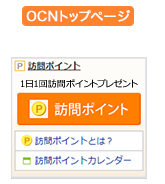

# INDEX
- [ABOUT](#ABOUT)
- [ENVIRONMENT](#ABOUT)
- [PREPARING](#PREPARING)
- [HOW TO USE](#HOW-TO-USE)
- [REFERENCE](#REFERENCE)

# ABOUT
- Using selenium, push [ocn top page](https://www.ocn.ne.jp/) "OCN訪問ポイント" button automatically to get Dpoint.
- This script can save session information to [cookies.pkl](./cookies.pkl)




# ENVIRONMENT
- python 3.8
- see [requirements.txt](./requirements.txt)
# PREPARING

```shell
# download repository
git clone https://github.com:RyosukeDTomita/ocn_dialy_login.git

# set up
cd ocn_dialy_login
touch cookies.pkl # future work
pip -r requirements.txt
```
# HOW TO USE

```shell
python3 ./ocn_daily_login.py --userid <docomo id> --password <password>
Type: Security code: Your SMS txt
```
# REFERENCE
